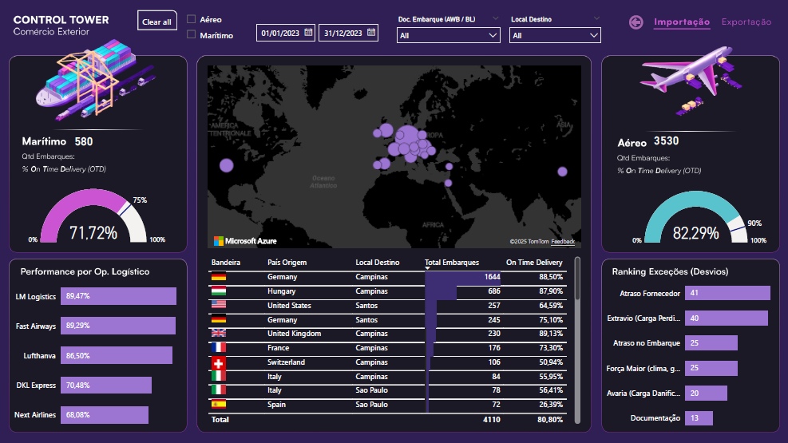

### Power BI Portfolio - Olivia Grauso
#### This repository contains my Power BI projects.
---
## Be Data-Driven

These days, everyone talks about being *data-driven*. It means using data to answer real business questions.
Instead of guessing, we look at numbers and trends to understand things like:

- Which region is selling the most?
- What type of customer buys from us most often?
- Which marketing campaigns are bringing in the most new customers?
- Is there a version of our product that is not performing as expected?
- Are we delivering orders on time across all regions?

These answers come from data that the business already produces, data that is often not explored strategically.

As the funny quote says: **"In God we trust. All others must bring data."** 

This portfolio demonstrates how I utilize Power BI to transform raw data into clear dashboards and visual reports that enable businesses to make informed decisions.

### Contact

LinkedIn: [Olivia Grauso](https://www.linkedin.com/in/oliviagrauso/)

Email: *olivia.grauso@outlook.it*

---

## 📦 Import Analysis – Exploratory Study

**Context**  
The analysis was conducted based on an import dataset that did not include contracted values due to the sensitive nature of this information. The initial goal was to explore the available variables, such as transport mode, shipment quantity, carrier, deviations, and on-time deliveries, to identify operational patterns and possible inconsistencies.

**Objective**  
To demonstrate how an exploratory analysis can raise relevant hypotheses and questions that highlight the importance of including financial data in future studies, especially to understand cost variations and optimization opportunities.

**Insights from the report**  
- Maritime shipping usually costs less than air freight. Why do more than 80% of our imports use the air freight?  
- If it is a supplier issue, can we verify that we are not being charged unnecessarily for this?  
- If it is an internal issue due to short lead times, what is causing it?

These are some of the questions to be discussed with the business team, ideally alongside cost data, to drive process optimization and save costs.

